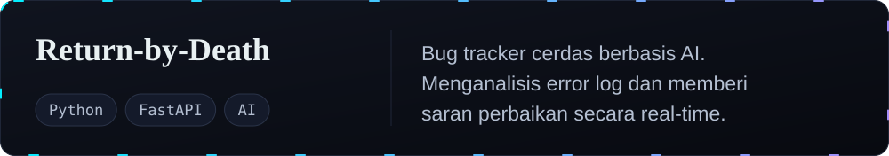
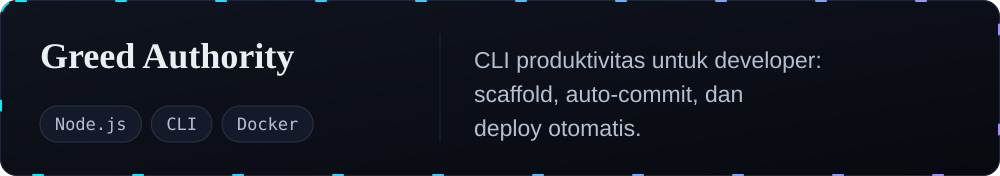
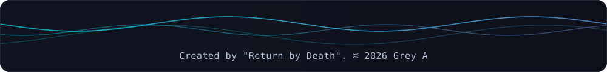

  
  
  

  

  

Saya membangun antarmuka web dengan fokus pada gerak: animasi, transisi, dan detail kecil yang membuat halaman terasa hidup. Filosofi saya sederhana: gagal, belajar, ulangi, seperti kemampuan Return by Death. Setiap bug adalah kesempatan untuk menjadi lebih kuat.

Sedang fokus pada web development, otomatisasi, dan tools produktivitas
Sedang belajar Rust dan CyberSecurity
Terbuka untuk kolaborasi open-source
Tanya saya tentang JavaScript, Python, React, Linux
Prinsip: satu kali gagal berarti satu checkpoint baru

  

  

  

  

  

  

<i>「もう一度、やり直す」 Kegagalan hanyalah checkpoint baru.</i>

  

