<!--
  Profil GitHub: Natsuki Subaru (tema Re:Zero).
  Langkah pemasangan ada di SETUP.md. Cari-ganti semua "USERNAME" dengan username GitHub kamu.
-->

  
  
  <!--
    Subaru: versi kecil (165x255) agar lolos batas ukuran proxy gambar GitHub.
    GIF HD dari Tenor (PQU7YOav7pQAAAAd) sekitar 36 MB dan kemungkinan besar tidak akan tampil.
    Untuk kualitas lebih tajam: kompres GIF-nya sampai di bawah 5 MB, simpan sebagai assets/subaru.gif,
    lalu ganti src di bawah menjadi "assets/subaru.gif".
  -->
  

  

  

Saya membangun antarmuka web dengan fokus pada gerak: animasi, transisi, dan detail kecil yang membuat halaman terasa hidup. Filosofi saya sederhana: **gagal, belajar, ulangi**, seperti kemampuan *Return by Death*. Setiap bug adalah kesempatan untuk menjadi lebih kuat.

- Sedang fokus pada **web development**, **otomatisasi**, dan **tools produktivitas**
- Sedang belajar **Rust** dan **CyberSecurity**
- Terbuka untuk kolaborasi **open-source**
- Tanya saya tentang **JavaScript, Python, React, Linux**
- Prinsip: *satu kali gagal berarti satu checkpoint baru*

  

<!-- Ganti nama, deskripsi, dan tag proyek di build_assets.py (fungsi build_card), lalu jalankan: python3 build_assets.py -->

  

  

  

<!-- assets/stats.svg dibuat otomatis oleh workflow "Profil" (lihat SETUP.md). -->

  

<!-- Ular kontribusi dan kalender 3D muncul setelah workflow "Profil" dijalankan sekali. -->

  <picture>
    <source media="(prefers-color-scheme: dark)" srcset="https://raw.githubusercontent.com/USERNAME/USERNAME/output/snake-dark.svg" />
    <source media="(prefers-color-scheme: light)" srcset="https://raw.githubusercontent.com/USERNAME/USERNAME/output/snake.svg" />
    
  </picture>

  

  

<i>「もう一度、やり直す」 Kegagalan hanyalah checkpoint baru.</i>

  

